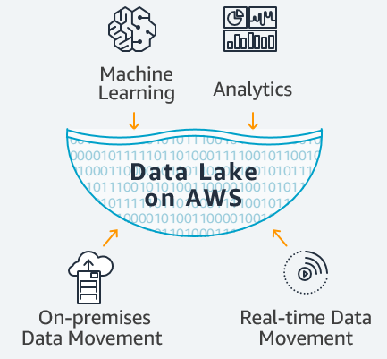
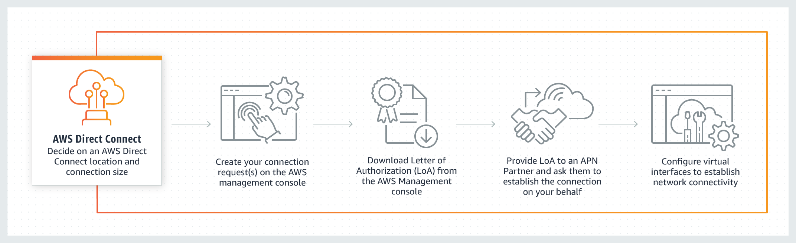
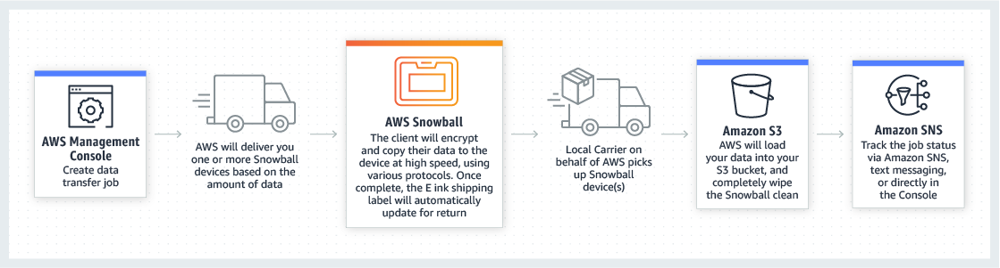
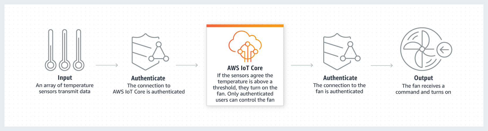
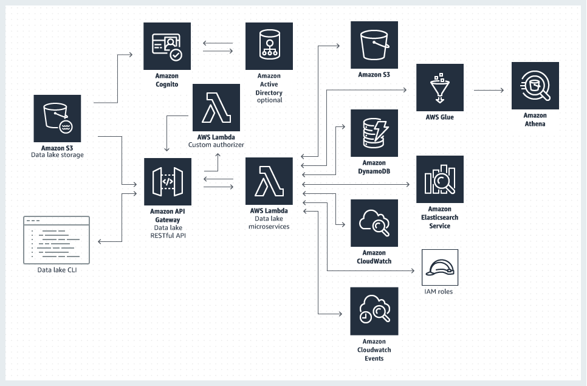
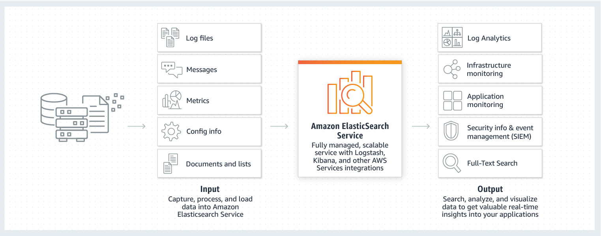
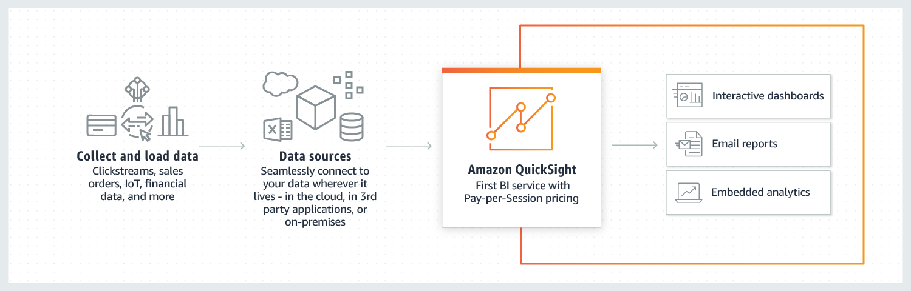
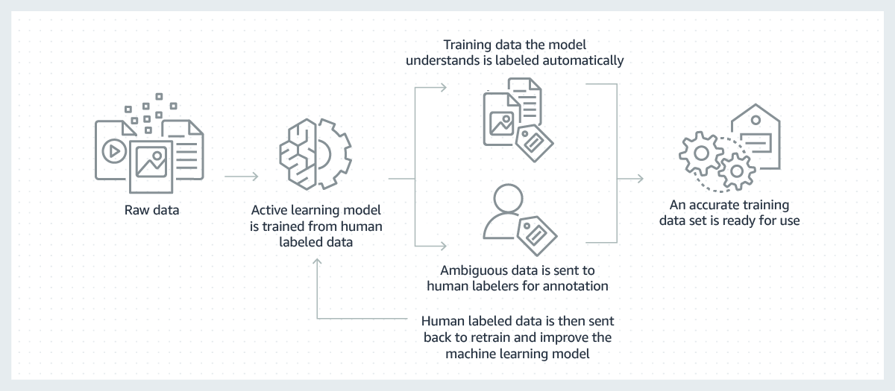

# Research-topic: Services for data science at AWS

Written by:  
**Jose Carlos Badillo**   
**Gabriela Martinez**  

## Introduction: what is *_data science_* and why is it important?
Defining what data science is, is still a non-trivial task. One could say that this concept is related to the discipline of building smart applications that leverage the power of statistics, computer science and specific domain knowledge and produce valuable outputs from data. With regards to this, Mike Driscoll's, CEO of Metamarket, says:  
  
> _"Data science, as it’s practiced, is a blend of Red-Bull-fueled hacking and espresso-inspired statistics._  
  
> _But data science is not merely hacking—because when hackers finish debugging their Bash one-liners and Pig scripts, few of them care about non-Euclidean distance metrics._  
  
> _And data science is not merely statistics, because when statisticians finish theorizing the perfect model, few could read a tab-delimited file into R if their job depended on it._  
  
> _Data science is the civil engineering of data. Its acolytes possess a practical knowledge of tools and materials, coupled with a theoretical understanding of what’s possible"._

The previous is a very illustrative definition of data science that leads us to think that in the end, data science is a science but also an art, in which the so well-known _data scientists_ **know more about statistics than a computer scientist and more about computer hacking than a statistician.** [See more at [1]](https://www.oreilly.com/library/view/doing-data-science/9781449363871/ch01.html).

Approximately by 2016, the _data scientist_ position was considered as the "sexiest" job of the 21st century. Apparently, this new role was top in many aspects: scarse, interesting and well-paid. But, why was that figure so important? and ultimately, why is the concept of **data science** so important? In a nutshell, data science matters because it helps us make better decisions and be more accurately prepared for the future. If we simply think about evolution, information leads to better decisions, and better decisions will make species live longer. As for a cooking recipe, a data scientist would be a chef that gathers and mix a set of previously well-known ingredients to produce new or better food. 

As a consequence, data science is the extension of the scientific method applied to data in almost all fields of knowledge. From movies recommendations, fraud detection and financial risk prediction to preventive maintenance, data science has appeared to help us transform data into useful information, which in the end means increased wisdom. The following chart presents some key opportunities that data science offers to many of companies' current challenges:
  
  
[Taken from: [2]](https://www.edureka.co/blog/what-is-data-science/)

Therefore, as may be expected, tech leader companies around the world have been working hard on the democratization of this concept, so that many other businesses and corporations can benefit themselves by making better decisions through data. In fact, data science is a business in which useful knowledge is sold as the most valuable product, something that most companies are willing to pay, as we are now aware of the fact that wrong decisions cost much more in the long term. [See more at [3]](https://www.forbes.com/sites/falonfatemi/2016/09/28/the-true-cost-of-a-bad-hire-its-more-than-you-think/#421ce09d4aa4).

**Amazon Web Services in the era of _data science_**  
Amazon Web Services is a whole ecosystem hosted by Amazon Inc. that offers on-demand cloud computing platforms to individuals, companies and governments through a pay-as-you-go basis. Also known as "AWS", this framework makes possible for its customers to access a variety of services in which data science utilities are included. The purpose of this brief repository is to approach the main products that AWS has disposed to perform _data science_, a concept that for the scope of this project will gather the following key topics:
  
* Data lakes.
* Data analytics.
* Data visualization.
* Machine learning.
* Artificial intelligence.

## 1. Data lakes, machine learning and analytics on top of AWS

AWS offers a set of services that allow companies create an environment that is able to process heterogeneous data and apply machine learning or analytics on it, as shown in the following schema:

  
[Taken from: [4]](https://aws.amazon.com/big-data/datalakes-and-analytics/)

In the following sections, we will approach the different stages that the previous environment covers.

### 1.1. Data movement
Using AWS services for analytics or machine learning, requires first having the data in a centralized repository, called _lake_, which is located in the AWS cloud. Building a lake, however, is a further step that can only be completed once the data coming from different sources has been moved to the cloud. Therefore, AWS offers a comprehensive set of tools to perform data movement, depending on if the data needs to be processed in real-time or in batch.

#### 1.1.1. On-premises data movement
* [AWS Direct Connect](https://aws.amazon.com/directconnect/) solution aims to establish a dedicated network connection between local premises and the AWS cloud. This connection uses the standard 802.1q VLANs and hence can be partitioned into multiple virtual interfaces, which allows the access to both public and private resources through different IPs. This solutions works as follows:

* [AWS Snowball](https://aws.amazon.com/snowball/) is a data transport solution for data in the scale of petabytes. According to AWS Snowball official website, _"customers today use Snowball to migrate analytics data, genomics data, video libraries, image repositories, backups, and to archive part of data center shutdowns, tape replacement or application migration projects"_. By creating a job in the AWS Management Console, a Snowball device will be shipped to the customer address, and no code or hardware purchasing is required. The whole process works as follows:

* Similarly, [AWS Snowmobile](https://aws.amazon.com/snowmobile/?nc2=h_m1) is a data transport solution built for an exabyte-scale. Each snowmobile (a 45-foot long ruggedized shipping container, pulled by a semi-trailer truck) can transfer up to 100PB, which makes easy _"to move massive volumes of data to the cloud, including video libraries, image repositories, or even a complete data center migration"_. AWS Snowmobile requires local installation and configuration by AWS experts. After setting up the connection and the network, data can be imported into Amazon S3 or Amazon Glacier.

#### 1.1.1. Real-time data movement
* [Amazon Kinesis](https://aws.amazon.com/kinesis/?nc2=h_m1) is a tool to collect, process and analyze streaming data in a real-time basis, _"such as video, audio, application logs, website clickstreams, and IoT telemetry data for machine learning, analytics, and other applications"_. It works as follows:

* [AWS IoT Core](https://aws.amazon.com/iot-core/?nc2=h_iot) is aanother real-time data capturing solution that focuses on Internet of Things devices data. This tool can connect billions of devices between them and also to other external endpoints or devices that use additional AWS services, such as AWS Lambda, Amazon Kinesis, Amazon S3, Amazon SageMaker, Amazon DynamoDB, Amazon CloudWatch, AWS CloudTrail, and Amazon QuickSight. Additionally, these apps can track the connected devices 100% of the time, even if they are not connected because the app _"stores the latest state of a connected device so that it can be read or set at anytime, making the device appear to your applications as if it were online all the time"_. The logic behind this concept is as shown:

   **First, connect devices:**
   

   **Second, secure connections and data:**
   

   **Third, process collected data** according to predefined business rules:
   

### 1.2. Data lakes
  
The paradigm of having Data lakes with raw structured and unstructured data is becoming the standard within the industry, because they allow storing the data coming from a wide set of sources in its most natural form so we can build Analytic views on the top.

Some use cases within industry of data going into the lake are log files data from click-streams, social media, internet connected devices. Meanwhile the future analysis to be done from this data could answer the needs of attracting and retaining customers, improving productivity, plan appropriate maintenance, make informed decisions.
  
AWS offers the data lake solution that automatically configures core AWS services to generate a data lake architecture on the AWS Cloud. This solution have the following architecture:

#### 1.2.1. Service management

The entry point to the data lake is done through the [Amazon API Gateway](https://aws.amazon.com/api-gateway/) which is a service that allows you to create, publish, maintain, monitor, and secure REST and Websocket APIs acting as the exposed "front doors" to access data, business logic, or functionality from the back-end services. 

The AWS solution provide access to the following data lake microservices:

- **Admin microservice** handles administrative services including user and group management, settings, settings, API keys, and role authorization for all operations within the data lake.
- **Cart microservice** handles all cart operations including item lists, adding items, removing items, and generating manifests for user carts.
- **Manifest microservice** uploads import manifest files, which allows existing Amazon S3 content to be bulk imported into a package.
- **Package microservice** handles all package operations including list, add package, remove package, update package, list metadata, add metadata, update metadata, list datasets, add dataset, remove dataset, process manifest, run AWS Glue on-demand crawler, list and access AWS Glue tables, and view dataset on Amazon Athena
- **Search microservice** handles all search operations including query, index document, and remove indexed document.
- **Profile microservice** Handles all profile operations for data lake users, including get and generate secret access key.
- **Logging microservice** interfaces between the data lake microservices and Amazon CloudWatch Logs.

All the previous microservices use [AWS Lambda](https://aws.amazon.com/lambda/) as the provisioner of the back-end services that can be consumed through a CLI or through the web console deployed as part of the solution. Some advantages of AWS Lambda are: avoid the use and management of servers and the continuous scaling of the application by running each code request in parallel.

#### 1.2.2. Object storage 

In a data lake the structure of the data or schema is not defined when data is captured. In fact, We can store data without considering design or caring about the information we must extract from this data in the future.

The AWS data lake solution stores and registers datasets and manifest files of any size in their native form in an [Amazon S3](https://aws.amazon.com/s3/) bucket.
A second S3 bucket configured for static website hosting hosts the data lake console which is exposed via the [Amazon CloudFront](https://aws.amazon.com/cloudfront/) to avoid direct access through the S3 endpoint.

#### 1.2.3. Data catalog 

When we work with data lakes there is a complexity added as there is not oversight of the contents. Therefore it is important to track the metadata.
The data lake solution uses **Amazon DynamoDB** tables to persist metadata for the data packages, settings, and user cart items. The following tables are available:

- **data-lake-packages:** persistent store for data package title and description, and a list of groups that can access the package.
- **data-lake-metadata:** persistent store for metadata tag values associated with packages.
- **data-lake-datasets:** persistent store for dataset pointers to Amazon S3 objects.
- **data-lake-cart:** persistent store for user cart items.
- **data-lake-keys:** persistent store for user access key ID references.
- **data-lake-settings:** persistent store for data lake configuration and governance settings.

Additionally this solution automatically configures an [AWS Glue crawler]() within each data package and schedules a daily scan to keep track of the changes.
The crawlers crawl through the datasets and inspect portions of them to infer a data schema and persist the output as one or more metadata tables that are defined in the AWS Glue Data Catalog.

#### 1.2.4. ETL process 

[AWS Glue](https://aws.amazon.com/glue/) is an ETL service that make easier the preparation of data for analytics. 
AWS Glue provides built-in classifiers to infer schemas from common files with formats that include JSON, CSV, Parquet, Apache Avro and more.

This services works very easily following 3 simple steps:

 1. Build your catalog: Pointing a crawler into data stored on AWS and then it discovers the data and stores the appropriate metadata in the AWS Glue Data Catalog.
 2. Generate and Edit Transformations: By selecting a data source and data target. AWS Glue will generate ETL code in Scala or Python to extract data from the source, transform the data to match the target schema, and load it into the target.
 3. Schedule and Run Your Jobs: Schedule recurring ETL jobs or chain them or invoke them on-demand.

#### 1.2.5. Security management

The security on a data lake is very important because the data stored inside might be very sensitive and the access allowed to each user need to be controlled. Therefore all the dataset objects stored in [AWS S3](https://aws.amazon.com/s3/) are encrypted using the [AWS KMS Key](https://aws.amazon.com/kms/) service. This security will be handled through [Amazon cognito](https://aws.amazon.com/cognito/) which will work as the authentication media for the different users of the data lake.  

#### 1.2.6. Indexing management

The solution uses an [Amazon Elasticsearch Service](https://aws.amazon.com/elasticsearch-service/) cluster to index data lake package data for searching. [See more at [4]](https://docs.aws.amazon.com/solutions/latest/data-lake-solution/appendix-b.html).

### 1.3. Analytics

#### 1.3.1. Interactive analytics
* [Amazon Athena](https://aws.amazon.com/athena/) is a platform to query data stored in Amazon S3 through standard SQL, once a schema has been defined. Moreover, Athena is a serverless tool, so no infrastructure costs are associated with the use of the service and it only charges final users for the queries they run. Besides this, no ETL processes need to be defined prior to start querying data. Also, Amazon Athena is integrated with AWS Glue Data Catalog, which allows users create unified metadata repositories available across all the Amazon suite of products and also schema versioning.

#### 1.3.2. Big data processing
* [Amazon EMR](https://aws.amazon.com/emr/) provides big data processing capabilities by enabling the use of frameworks such as Spark and MapReduce and more than 19 open source projects that include Presto, Hive, HBase and Flink, which can also be connected to Amazon S3 or DynamoDB. Amazon EMR operates through notebooks based on the Jupyter interface and allows users create ad hoc queries, exploratory analysis, ETLs, machine learning, log analysis, web indexing amongst others.

#### 1.3.3. Data warehousing
* On the traditional OLAP side, data warehousing querying is also possible thanks to [Amazon Redshift](https://aws.amazon.com/redshift/), the tool for building scalable data warehouses that can access petabytes of data. Moreover, according to the official documentation _"Redshift delivers ten times faster performance than other data warehouses by using machine learning, massively parallel query execution, and columnar storage on high-performance disk"_ and additionally, it costs _"less than 1/10th the cost of traditional data warehouses on-premises"_, with prices that start at $0.25 per hour.

#### 1.3.4. Real-time analytics
* As mentioned before, [Amazon Kinesis](https://aws.amazon.com/kinesis/?nc2=h_m1) enables the collection, processing and further analysis of streaming data that includes Internet of Things telemetry data, logs generated from applications running and streams from clicks on websites.

#### 1.3.5. Operational analytics
* [Amazon Elasticsearch Service](https://aws.amazon.com/elasticsearch-service/?nc2=h_m1) is the Amazon tool that enables the use of Elasticsearch APIs (for Java, Python, Rubi, PHP, Javascript and Node.js), Kibana and Logstash. This service is also compatible with the AWS cloud stack and can be configured in a scalable way. Elasticsearch is a highly scalable open-source search and analytics engine built on top of MongoDB that performs extremely fast searches for all types of data and big volumes almost in real-time. This source is behind the searching and indexing processes that companies such as Wikipedia and LinkedIn implement, as in general, Elasticsearch is used as the underlying search engine for complex search features in applications. Some of the advantages of Elasticsearch can be summarised as follows:

   * **Document-oriented:** storing is made through structured Json documents in which all fields are indexed by default using the Lucene StandardAnalyzer. This results in a higher performance when searching because it offers powerful full-text search capabilities.
   * **Supports extremely fast full-text search through its inverted index.** According to the [official documentation](https://www.elastic.co/guide/en/elasticsearch/guide/current/inverted-index.html) _"an inverted index consists of a list of all the unique words that appear in any document, and for each word, a list of the documents in which it appears"_.
   * **Restful API** that allows querying Elasticsearch while providing a user interface.
   
Moreover, the Amazon Elasticsearch Service works as shown below, offering a bunch of different analytical services on top of Elasticsearch besides its main capability associated with full-text search:

#### 1.3.5. Visualization
* [Amazon Quicksight](https://aws.amazon.com/quicksight/?nc2=h_m1) is AWS business intelligence scalable tool that allows presenting insights up to a 10.000 users simultaneously. Through this tool, it is possible to create and publish dashboards not only with descriptive information but also with machine learning capabilities. Moreover, dashboards can be accessed from any device and can be embedded into different applications. In particular, this solution offers a Pay-per-Session pricing schema that allows giving access
to everyone to the data they need, while only paying for what they use. This service works as described in the following graph:

## Introduction to Artificial Intelligence and Machine Learning
Often abbreviated as "AI", _"Artificial Intelligence (AI) is the field of computer science dedicated to solving cognitive problems commonly associated with human intelligence, such as learning, problem solving, and pattern recognition"_. [Taken from: [5]].(https://aws.amazon.com/machine-learning/what-is-ai/). 

According to professor Pedro Domingos, a researcher of the field at University of Washington, there are five main _tribes_ that conform the Machine Learning. One of them is related to the Bayesians, people engaged with statistics and probability that have developed the field into different real-world applications thanks to the advancements in statistical computing, the reason why we can talk about "machine learning" for advanced bayesians techniques applied into use cases. 

Moreover, another tribe within the machine learning paradigm is conformed by the connectionists, whose root comes from neuroscience. They have led this subfield of study to become what is commonly known as "deep learning" due to advances in network computation. Both Machine learning (ML) and deep learning (DL) are science fields derived from the discipline of Artificial Intelligence. [See more at: [6]](https://medium.com/42ai/the-5-tribes-of-the-ml-world-670ebce96b4c). Those subfields are generally composed of several techniques that are often referred to as _supervised_ or _unsupervised_, depending on if the training data includes the desired output (which corresponds to the first split) or not.

### 1.4. Machine learning
According to the previous, machine learning _"is the name commonly applied to a number of Bayesian techniques used for pattern recognition and learning"_. [Taken from: [5]]. This is usually translated into a variety of algorithms that learn from historical data and make predictions based on it. Unlike typical computer code developed by software programmers, statistical models aim to return back a variable of interest based on patterns found in historical data rather than generating an output from a specific given input. Within an organization, ML is often following this lifecycle:

**Use cases** in which ML is applied include some of the following:
* _Anomaly detection:_ to identify observations that do not comply with a expected pattern.
* _Fraud detection:_ to identify potential fraudulent actions in industries such as banking or retail.
* _Customer churn:_ to predict when customers are prone to leave a business and engage them through a specific marketing mix.
* _Content personalization:_ where most of the product recommenders fit.

ML or predictive analytics on top of AWS can be performed through different alternatives, depending on if teams look for predefined interfaces to deploy deep learning models or if they want to built machine learning models from scratch in a platform or application service. 

#### 1.4.1. Frameworks and interfaces
* [AWS Deep Learning AMIs](https://aws.amazon.com/machine-learning/amis/):
Amazon provides different machine images where pre-installed EC2 instances can be launched together with established common deep learning models such as TensorFlow, PyTorch, Apache MXNet, Chainer, Gluon, Horovod, and Keras that train either customized or pre-defined artificial intelligence models. Those Amazon Machine Images (AMIs) can be supported in Amazon Linux, Ubuntu and Windows 2016 versions. 

Besides the deep learning framework support, this special AMIs accelerate the model traning phases by means of the following:

* **GPU Instances**: Amazon EC2 P3 instances can be configured with up to 8 NVIDIA® V100 Tensor Core GPUs and up to 100 Gbps of networking throughput, which speeds machine learning applications. Specifically, Amazon EC2 P3dn.24xlarge is the most recent machine within the P3 family. According to the vendor, _"Amazon EC2 P3 instances have been proven to reduce machine learning training times from days to minutes, as well as increase the number of simulations completed for high performance computing by 3-4x"._ [See more at [5]](https://aws.amazon.com/ec2/instance-types/p3/).
* **Demanding computing CPUs**: the C5 family is part of the Amazon EC2 instances offered for running advanced compute-intensive workloads. These instances are powered by the Intel Xeon Platinum 8000 series (Skylake-SP) processor and a Turbo CPU clock speed of up to 3.5 GHz. Also, they can provide up to 25 Gbps of network bandwidth. [See more at [6]](https://aws.amazon.com/ec2/instance-types/c5/).
* **Python and Anaconda**: both Jupyter notebooks and the Anaconda platform are straight away available for the installation of required packages and also to access their specific scientific computing tools such as Orange 3 and Spyder. [See more at [7]](https://www.anaconda.com/distribution/).

#### 1.4.2. Platform services
* [Amazon SageMaker](https://aws.amazon.com/sagemaker/?nc2=h_a1) is the Amazon platform to build, traing and deploy machine learning models into production environments. This tool, as well as the Deep Learning AMIs, automatically configures TensorFlow, Apache MXNet, PyTorch, Chainer, Scikit-learn, SparkML, Horovod, Keras, and Gluon frameworks, as well as hosted Jupyer notebooks, which altogether can host more than 200 pre-built trained models from the AWS marketplace and can also host any other algorithm or framework by building it into a Docker container. [See more at [8]](https://aws.amazon.com/sagemaker/?nc2=h_a1). Note, however, that they can connect to other EC2 Amazon instances that are not necessarily optimized for speeding up artificial intelligence or machine learning models, as happens in the case of the Amazon Deep Learning AMIs.

   One interesting feature to highlight has to do with an additional data labeling service that is offered together with Amazon SageMaker. It is called Amazon SageMaker Ground Truth and allows access to public and private human labelers that can accelerate the data labeling process and help in the automation of the labeling within the machine learning models in further stages. According to the [official documentation](https://aws.amazon.com/sagemaker/groundtruth/), Ground Truth has contributed to a 70% in the reduction of the costs associated to labeling in all the business cases it has been used. The whole functioning of the tool is as follows:

Also, note that this service is similar to the initial one provided by [Amazon Mechanical Turk](https://www.mturk.com/), which is an outsourcing crowdsourcing marketplace for different jobs and business processes.

#### 1.4.3. External marketplace solutions
The [AWS Marketplace](https://aws.amazon.com/marketplace) puts together different external techonology products and services that can be integrated to the whole Amazon cloud computing ecosystem in the form of applications. Popular products in the marketplace are related to one of the following categories: operating systems, security, networking, storage, business intelligence, databases, DevOps and machine learning.

Some popular examples within the business intelligence category are:
* [**Tableau Server**](https://aws.amazon.com/marketplace/pp/B00ZYOIFLS?qid=1556101797937&sr=0-5&ref_=brs_res_product_title) for device-agnostic visual analytics.
* [**Qliksense Enterprise**](https://aws.amazon.com/marketplace/pp/B01M5HCC0D?qid=1556101797937&sr=0-9&ref_=brs_res_product_title), also for building business intelligence and reporting dashboards.
* [**SAS University Edition**](https://aws.amazon.com/marketplace/pp/B00WH10IKW?qid=1556101797937&sr=0-3&ref_=brs_res_product_title) _"for teaching and learning statistics and quantitative methods"_.
* [**Matillion ETL for Amazon Redshift**](https://aws.amazon.com/marketplace/pp/B010ED5YF8?qid=1556101797937&sr=0-1&ref_=brs_res_product_title) to build ETL/ELT pipelines oriented to data storage in Amazon Redshift.

Similarly, for machine learning it is possible to find remarkable products such as:
* [**H2O Driverless AI**](https://aws.amazon.com/marketplace/pp/B07JN71K8N?qid=1556102162197&sr=0-4&ref_=srh_res_product_title), which is an artificial intelligence platform that automates machine learning workflows such as feature engineering, model validation, model tuning, model selection, model deployment and also data visualization. Moreover, according to their own description, the platform _"aims to achieve highest predictive accuracy, comparable to expert data scientists, but in much shorter time thanks to end-to-end automation,"_ something that could eventually put many employments within the data science industry at risk.
* [**KNIME Server Small for AWS**](https://aws.amazon.com/marketplace/pp/B07JH2TGJV?qid=1556102162197&sr=0-7&ref_=srh_res_product_title) aims to deploy KNIME Analytics Platform within the Amazon cloud ecosystem to automate machine learning models and ETL/ELT workflows.
* [**Databricks Unified Analytics Platform**](https://aws.amazon.com/marketplace/pp/B07K2NJKRW?qid=1556102162197&sr=0-10&ref_=srh_res_product_title): powered by the creators of Apache Spark and MLflow _"it provides data science and engineering teams ready-to-use clusters with optimized Apache Spark and various ML frameworks(e.g., TensorFlow) coupled with powerful collaboration capabilities to improve productivity across the ML lifecycle"_.
* [**ML Workbench for TensorFlow**](https://aws.amazon.com/marketplace/pp/B07MFRDXTB?qid=1556102162197&sr=0-9&ref_=srh_res_product_title) provides a zero-admin solution that includes the architecture necessary to run machine learning jobs in an optimal way. It includes Ubuntu 18.04 with Jupyter, JupyterLab, TensorBoard and preconfigured conda environments for Tensorflow 1.13.1 and TensorFlow 2 Alpha including the latest matching versions of CUDA 10.0 and cuDNN 7.5.0 for GPU-accelerated computing.

Finally, is important to acknowledge that the concept of _deep learning_ is also related to ML, as DL involves layering algorithms that often allow a greater understanding of the data. These algorithms, as opposed to classical ML models such as regressions, do not aim to create a explainable set of relationships between variables, but instead they are relying on their "_layers of non-linear algorithms to create distributed representations that interact based on a series of factors"_, which allows scientists to find more patterns than it is possible to code or even recognize and take them into consideration to train complex prediction models [See more at [9]](https://aws.amazon.com/machine-learning/what-is-ai/). Some of the use cases of deep learning include:

* Image and video classification.
* Speech recognition.
* Natural language processing.
* Recommender engines.

## 2. Artificial intelligence on top of AWS

